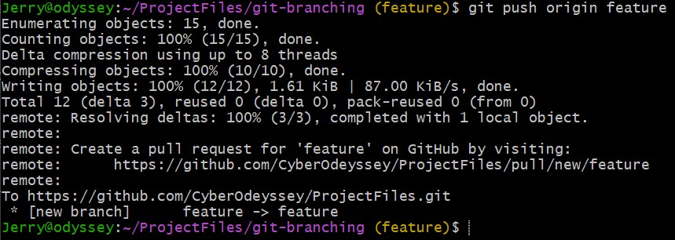

# Git Branching

## Project Tasks
1. Create a new feature branch (git branch feature)
2. Add or edit a file in the feature branch, then commit the change
3. Push the feature branch to the remote repo
4. Merge the feature branch into the main branch (git checkout main, git merge feature)
5. Create another branch and make conflicting changes with main
6. Merge the conflicting branch into main and resolve the conflicts manually

## Solution
__step 1__

use the command `git branch [branch-name]` to create a new branch.

You can also use the command `git checkout -b [branch-name]` to create the branch

NOTE: The  `git checkout -b [branch-name]` command is equivalent to running the command:
`git branch [branch-name] && git checkout [branch-name]`

__step 2__

Add a file named file.txt and commit the change 

__step 3__ 

To push this branch to the remote repo

__step 4__

To merge the feature branch into the main branch
First switch to the main branch 
Run the command `git merge [branch-name]`

 
__NOTE:__ 

- FF merge = no merge commit, linear history; 

    normal merge = new commit with two parents.

- Uncommitted changes  block merge until committed/  stashed.

- Conflicts occur only when both branches have committed edits to the same place.

__step 5__ 

Create a new conflict branch

switch to new branch to change what is in file.txt

__how am I ahead by 3 commits despite not making any commit in the conflict branch__

The reason is because your local `main` has 3 commits that `origin/main` doesn’t — Git just compares the two branch pointers.

__Why was the switch successful despite the changes in file.txt?__

It worked because file.txt was empty in **main**. Therefore, no overwrite issues. 

In summary:
1. **Unstaged edits** → move with you if target branch doesn’t overwrite them.
2. **Staged edits** → always block branch switching.
3. **Untracked files** → fine, unless target branch already has a tracked file with same name.

Actually creating the conflict

__step 6__
Merging into main
First, switch to the main branch (The reason being that it is the target branch you want to merge into)

run the `git merge` command when in the main branch

__when a merge fails__

You can do any of the following:
- Fix conflicts and continue (git add + git commit)
- Abort the merge using the command: `git merge --abort`
- Stash/clean workspace and retry later

VS code and some other editors provides helpful GUI to resolve merge conflicts. 

git ships with git mergetool to resolve conflicts. However, VS code's GUI is easier to use. 

I would be using VS code's git Merge Editor to resolve the conflict. 

__Project completed__

## CHALLENGES FACED
Omoooo I face challenge no be small. 
Not regardig the project task per say. but omooo.
GPT wan confuse me walahii

__The confusion__
1. **Unstaged edits** → move with you if target branch doesn’t overwrite them.

This word "overwrite" showed me pepper. 

__The Fruit__
Unstaged edits → move with you when switching branches, as long as the target branch’s commit doesn’t have a different version of those files.

A branch always points to a commit.

When you switch, Git reshapes your working directory to match that commit.

If your local edits would be replaced by that commit’s files, Git blocks the checkout (clobber).

If the commits match, your edits ride along safely.

__Proof of the fruit__

## Command Summary

__Creating branch__
`git branch [branch name] [commit hash/revision]`

create and switch `git checkout -b [branch name]` 

Switching branches

`git checkout [branch name]`

`git switch [branch name]` -- newer command

Renaming branch
`git branch -m [new-name]` --> change HEAD branch

`git branch -m [new-name] [old-name]`

__Deleting a branch__

>NOTE: You cannot delete HEAD branch 
>
`git branch -d [branch-name]`

`git push origin --delete [branch-name]` ---> delete a remote branch