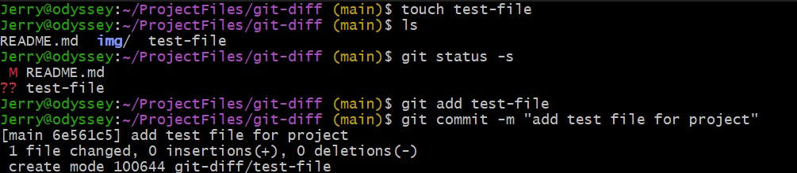
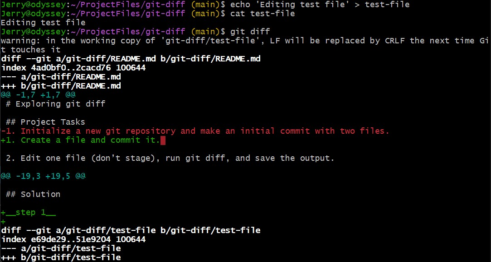
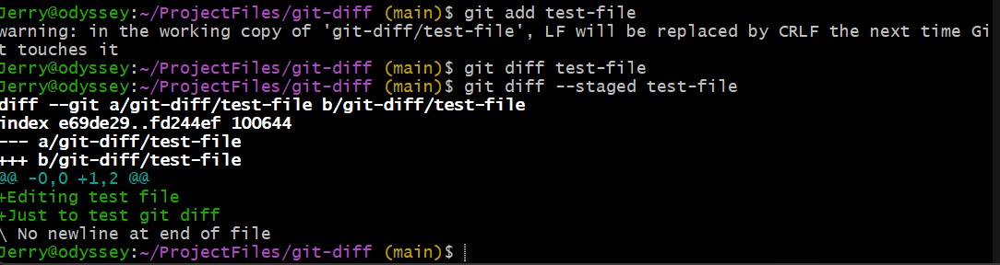
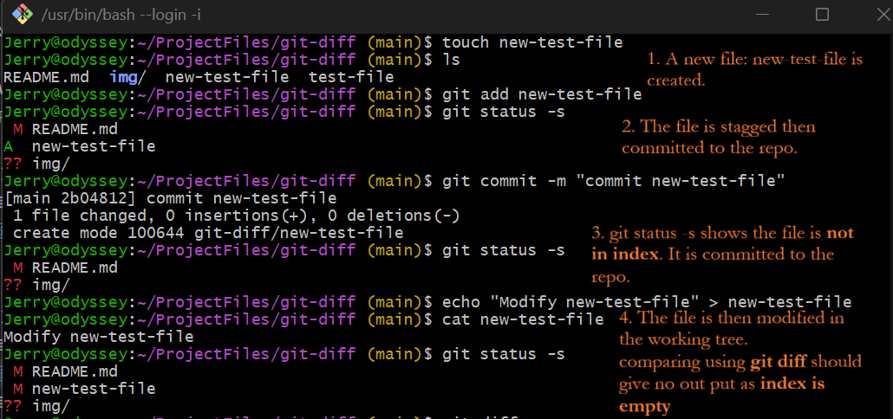
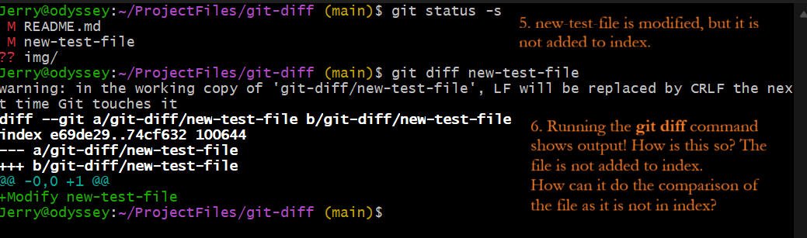
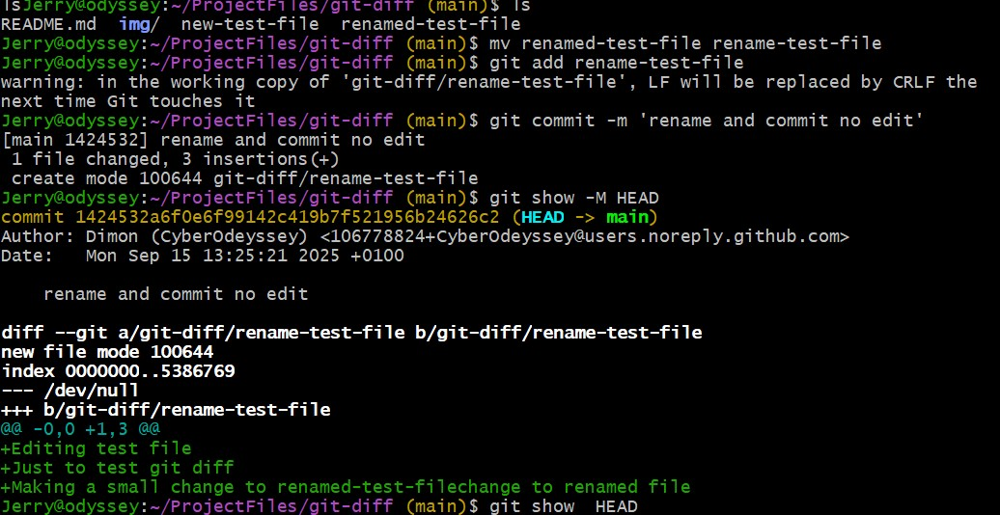
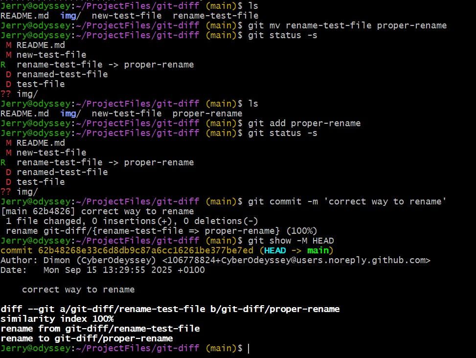

# Exploring git diff

## Project Tasks
1. Create a file and commit it. 

2. Edit one file (don’t stage), run git diff, and save the output.

3. Stage the file, run git diff and git diff --staged, and save both outputs.

4. (Bonus) Rename a file, make a small change, commit it, and capture the diff showing the rename.

## Solution

__step 1__
Use the `touch [filename]` command to create a file.



Commit the file.

__step 2__



I editted the file by adding content to it.

I also ran the git diff command

__step 3__



I stagged the file, ran the `git diff` command, then the `git diff --staged`

`git diff` returned no output, but `git diff --staged` did. 

__Hmmm. . .__

Before observing the output, I used to think that `git diff` compares what is in working directory with what is contained in the repo (precisely: the latest commit) 

__what actually happens__

`git diff` shows the differences between your working directory (files on disk) and the index / staging area

__debunking a myth__

so. . .It is clearer now, and I have a better understanding of what `git diff` does. 
Or, do I. . .not really. 

I tried something. . . 





I created a file, staged and committed the file. 

My __index__ is now empty as the file has been committed already. 

I modify the file (make changes in my working dir). 

I run `git diff`, yet I see differences! 

why?, but my index is empty! or is it?

__Clarification__

The notion: “The index is empty once I commit,”is a gross misunderstanding.

From git docs: “The index stores a snapshot of the content of the working tree, and it is this snapshot that is taken as the contents of the next commit.”

The wording “staging area” makes it sound like a temporary holding place that clears out after a commit. 

In reality: It’s always a full project tree.

---

**Think of it this way:**

* **Commits**: frozen tree snapshots → static, versioned, permanent history.
* **Index**: mutable snapshot in `.git/index` → rewrites on `git add`, always full project image.
* **Commits** live forever (unless garbage-collected).
* **Index** is temporary, not versioned (overwritten until committed/stashed).
* Workflow chain:
  `HEAD (commit tree)` ←→ `Index (next commit image)` ←→ `Working Directory`.

---

__step 4__

I tried using the `mv` command to rename the file, but it kept showing as a deletion.



However, using the `git mv` command does the trick.



---
__Know the diff__ `git mv` vs `mv`

* `mv old new`: only renames at the filesystem level.

  * Git sees it as: `old` deleted + `new` added.
  * Rename detection is heuristic, may or may not show as rename.

* `git mv old new`: updates both the filesystem **and** the Git index.

  * Git records the rename explicitly.
  * Commit will always show `rename from ...` / `rename to ...`.

✔ Use `git mv` for reliable rename tracking.

__task completed__

---

## Command Summary
``` 
git diff --> compare what is in disk with index 

git diff --cached --> compare index against commit (HEAD)

git diff [filename] --> diff for a specific file

git diff [commit1] [commit2] -- [filename]
git diff [branch1]..[branch2] -- [filename]
```