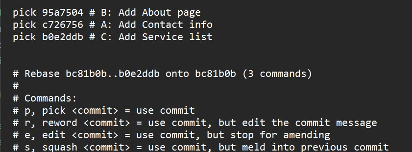
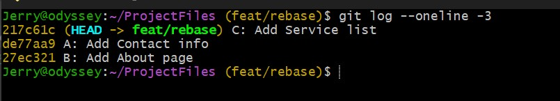

# __Git Interactive Rebase__

# __Project Tasks__

_Interactive Rebase (Squash)_
---
1. Creat a branch with the name `feat/rebase` 

    - Create a file blog.txt with the commit message: 
        
        "A: First blog post" 

    - Add text to the file and commit with message:
    
        "B: Append Fitx typo in blog post" 

    - Add more text to the file and commit with the message: 
    
        "C: Append Updated blog post formatting"

2. Run an interactive rebase over the last 3 commits: 
 use the command `git rebase -i HEAD~3`
    
3. Squash the commits starting with "B:. . ." and "C:. . ."  with the commit "A: First blog post."

    - For the suqashed commit, use the commit message  
        
        "D: Add first blog post with formatting"

_Interactive Rebase (Reword & Reorder)_
---

1. On the feat/rebase branch, add information to the blog.txt file and make 3 commits with commit message in this order:
    -  "A: Add Contact info"
    -  "B: Add About page"
    -  "C: Add Service list"

2. Enter interactive rebase mode using command:
`git rebase -i HEAD~3`

3. Reorder commits so that they are in the below order:
     
     - "C: Add Service list"
     - "A: Add Contact info"
     - "B: Add About page"

4. Reword the lastest commit with message:
    - "C: Add Service list section (reword)"

_Split a Commit (Advanced Interactive Rebase)_
---
1. On feat/rebase branch, create two files:

    - roles.txt 
    - team.txt

    Commit both files with commit message: "Add team information"

2. Split both commits into two separate commits using interactive rebase.

    Each file should be commited with commit message as shown below:

    | file name  | commit message  |
    | ---        | ---             |
    | team.txt | Add team members         |
    | role.txt | Define team member roles |

3. Continue the rebase so history has two neat commits instead of one.

__Solution__

_Interactive Rebase (Squash)_
---
__step 1__

Use the `git branch` command to create a new branch 
then add the commits. 

__step 2__

Running the command `git rebase -i HEAD~3` opens the text editor and shows the last 3 commits. 

When you run the command:
`git rebase -i HEAD~N` it opens last N commits in an editor.

`git rebase -i` (interactive rebase) lets you edit, reorder, squash, or delete commits in your branch’s history before pushing.

 

>NOTE: The order of the commits displayed in the text editor is different from the `git log` output. 
The latest commit with message "C: Append updated blog post" is shown first in `git log` output but shown last in the editor when you run the git rebase command. 
>

__step 3__

To squash the commits, change the text from 'pick' to 'squash' 

The 'squash' option merges the commit into previous one

In the above commit "C:..." is squashed into "B..." and "B:..." is squashed into "A...". 

After saving the file, another text editor is opened which allows you to choose the commit message for the newly squashed commit. 

In this case, we choose the commit message:

"D: Add first blog post with formatting"

_Interactive Rebase (Reword & Reorder)_
---

__step 1__

__step 2__

use the command `git rebase -i HEAD~3` to enter interactive rebase mode
   
  

NOTE: Based on the above arrangement, the commit "C: Add Service list" would be the latest commit preceeded by "A..." then "B..." 

4. Reword the lastest commit with message:
    - "C: Add Service list section (reword)"

Use the `git rebase -i HEAD~1` to pick the latest commit

After opening the editor, change pick to 'edit'
This enables you to edit the commit content

Next, use the `git commit --ammend` command to edit the commit

When you complete editing the commit message, use the `git rebase --continue` command to complete the edit.

_Split a Commit (Advanced Interactive Rebase)_
---
__step 1__ 

__step 2__

Use the `git rebase -i` command to enter interactive rebase mode

Choose the 'edit' command for the commit you wish to split

After which you close and save the file.

Use the `git reset HEAD^` to move the current branch pointer back one commit, removing the latest commit but keeping its changes staged for re-commit or modification.

Then you can make a separate commit for each file.

__step 3__ 

After the commit, use the `git rebase --continue` to complete the rebase. 

__More on git reset__

How `git reset` works 

*Image credit: [ByteByteGo](https://bytebytego.com/)*

>NOTE:
Be careful with the `git reset --hard` command
it’s a nuke command 💣.
git reset --hard gives no warning. 
Once you run it wipes out both staged and unstaged changes, resetting everything in your working directory to match the target commit exactly.
Only committed changes survive.

__Project complete__