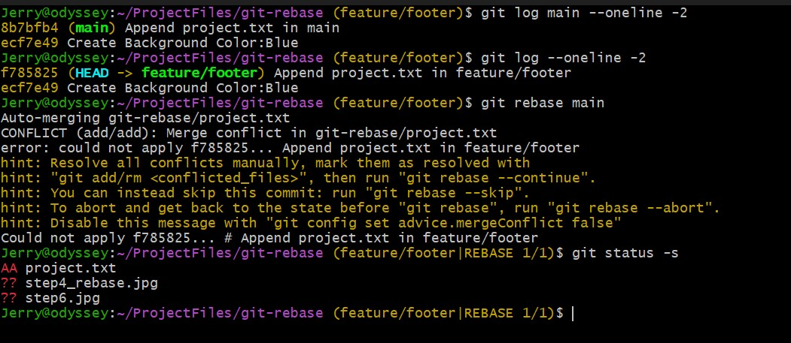

# Git Rebase

## Project Tasks

1. Create a new branch feature/notes from main.

2. Add two commits on feature/notes:
    - First commit: create notes.txt with text  Header section.
    - Second commit: append Header styles to notes.txt.

3. On main, add a commit that creates background.txt with text Background color: blue.

4. Rebase feature/notes on top of main so that notes.txt commits come after the background commit.

5. Create a new branch feature/footer from main.
    
6. Add a commit in feature/footer that appends Footer section to project.txt.
    
7. On main, add a commit that also appends Main body text to project.txt.

8. Rebase feature/footer on top of main.
    - Resolve the conflict in project.txt so both changes appear.
    - Continue the rebase until it finishes.

## Solution
__step 1__

create a new branch using the `git branch` command.

    
__step 2__ 

Add two commits to the branch

__step 3__

switch to the main branch using either the `git switch main` or `git checkout main` command. 

Then, create a file named background.txt 

Afterwards, commit the file with commit message: 
"Create background color: Blue"

__step 4__

To rebasase the feature/notes branch.

First, ensure you are in the feature/notes branch else checkout to the feature/notes branch. 

Then, use the `git rebase main` command to rebase feature/notes with the main branch.

__step 5__

Ensure you are checkedout to the main branch.  
Afterwards, use the `git branch feature/footer` command to create a new branch

__step 6__

Create a commit with commit message: "Add Footer section"

__step 7__ 

Create a file  file project.txt in main in the same location as project.txt in feature/footer. 

Commit the file with commit message: "Add Footer section" 

>NOTE: The conflict is NOT because they have the same commit message, but due to the content of the same file modified differently.  
>

The result is a rebase conflict!

__step 8__

The rebase conflict is resolved similarly to how you would a merge conflict. 

However, you must resolve all conflicting conflicts during the rebase before continuing the rebase. 

After you have resolved all conflicts, stage the changes. Then, use the `git rebase --continue` command to complete the rebase. 

__task complete__

__More Information__

How to move files between branches

__challenge/Inforamtion__

Clarify rebase confusion. which becomes the base. confusing statements: 
moves to the tip of the main branch, becomes the base 

Is there any difference in rebase conflict if

1. The file path is different then modiifed
2. The file path is the same then modified
3. The file is checked out from other branch